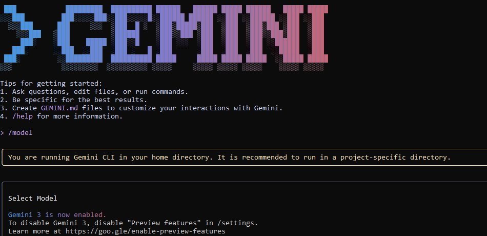

## TASK 3 

Q1) What new improvements were introduced in Gemini 3.0?

A) Gemini 3.0 introduces several improvements over Gemini 2.5 including better reasoning with simplified prompts optimized temperature handling for deterministic outputs enhanced PDF and document understanding via improved OCR and media resolution

Q2) How does Gemini 3.0 improve coding & automation workflows?

A) Gemini 3.0 improves coding and automation by supporting agentic coding, allowing the model to plan, write code, and run commands. With vibe‑coding it can handle complex multi-step tasks from natural language prompts. Its large context window helps understand big codebases and it integrates with tools like AI Studio and Gemini CLI.

Q3) How does Gemini 3.0 improve multimodal understanding?

A) Gemini 3.0 introduces granular control over multimodal vision processing via the media_resolution parameter. Higher resolutions improve the model's ability to read fine text or identify small details.

Q4) Name any two developer tools introduced with Gemini 3.0?

A) Gemini-CLI
   AI-studio

   
